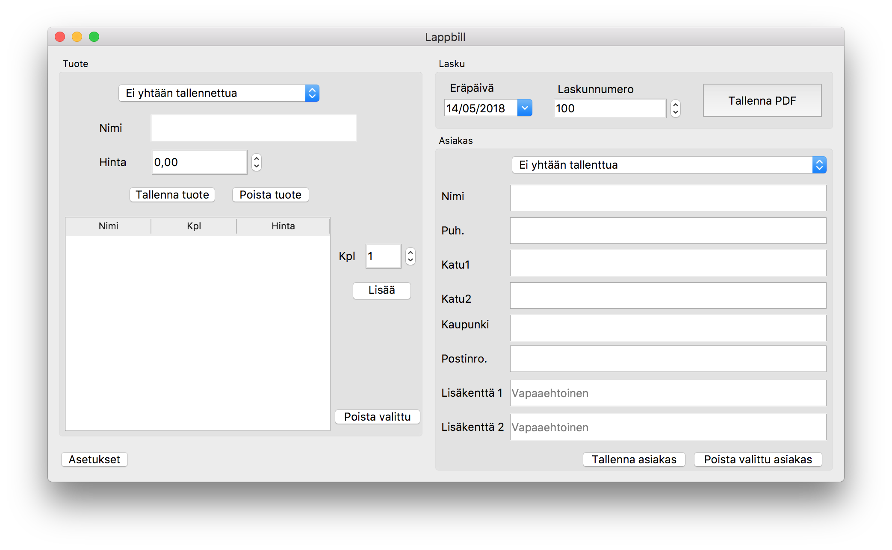
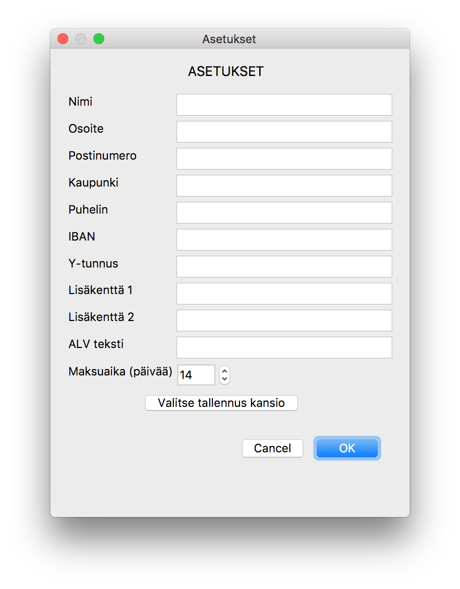

# Lappbill 
Lisenssi: [BSD-2-Clause](LICENSE)

Simppeli ohjelma tilisiirtolomakkeiden tekemiseen.

# Käyttöohje
Ohjelman ensimmäisen kerran käynistyessä aukeaa asetusikkuna joka pitää täyttää.
Muista myös valita tallennus kansio minne tehdyt laskut tallentuvat.

